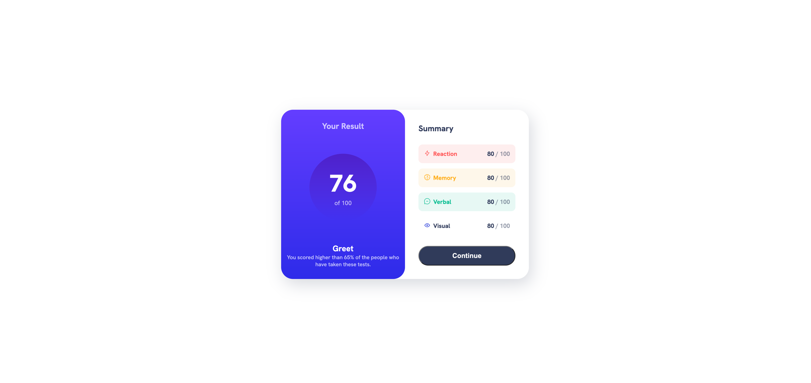

# Frontend Mentor - Results summary component solution

This is a solution to the [Results summary component challenge on Frontend Mentor](https://www.frontendmentor.io/challenges/results-summary-component-CE_K6s0maV). Frontend Mentor challenges help you improve your coding skills by building realistic projects. 

## Table of contents

- [Overview](#overview)
  - [The challenge](#the-challenge)
  - [Screenshot](#screenshot)
  - [Links](#links)
- [My process](#my-process)
  - [Built with](#built-with)
  - [What I learned](#what-i-learned)
  - [Continued development](#continued-development)
  - [Useful resources](#useful-resources)
- [Author](#author)
- [Acknowledgments](#acknowledgments)

## Overview

### The challenge

Users should be able to:

- View the optimal layout for the interface depending on their device's screen size
- See hover and focus states for all interactive elements on the page

### Screenshot



### Links

- Solution URL: [click me](https://github.com/yxlaisj/results-summary-component)
- Live Site URL: [click me](https://yxlaisj.github.io/results-summary-component/)

## My process

### Built with

- Semantic HTML5 markup
- CSS custom properties
- Flexbox
- desktop workflow

### What I learned

- use css flex box
- make responsible layout

```html

```
```css
@media screen and (max-width: 37.5rem) {

  main {
    flex-wrap: wrap;
  }

  .result-box {
    width: 100%;
    border-radius: 0 0 2.1875rem 2.1875rem;
    padding: 2rem 4rem;
    gap: 2rem;
  }

  .summary-box {
    width: 100%;
  }
}
```
```js

```

## Author

- Github - [yxlaisj](https://github.com/yxlaisj)
- Frontend Mentor - [@yxlaisj](https://www.frontendmentor.io/profile/yxlaisj)
